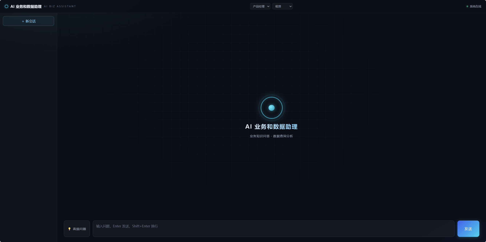
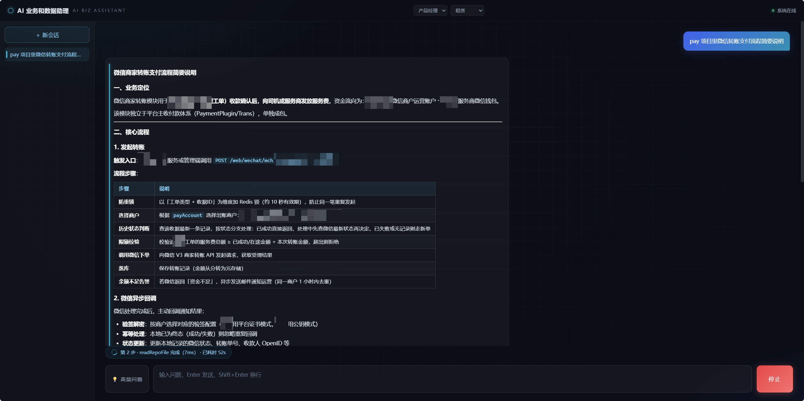
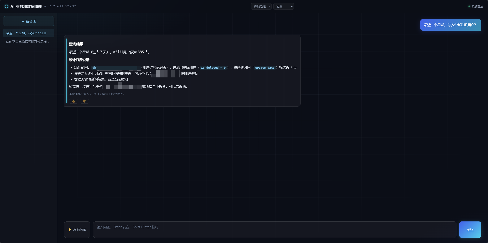

# AI Biz Assistant — AI 业务助理

> **代码知识问答 + 自然语言数据查询**，一个对话界面搞定。
>
> 面向企业内部的 AI 业务助理框架——让开发、测试、产品、运营都能用自然语言查代码逻辑、查业务数据，不再靠"问人"和"找 DBA"。



---

## ✨ 核心能力

### 📚 代码知识问答

接入业务仓库源码 + 技术文档，用自然语言提问即可获得带**源码路径引用**的回答。

- 支持多仓库统一检索，自动定位相关代码与文档
- 回答附带文件路径依据，可追溯、可验证
- 同义改写自动识别，业务术语的多种说法都能命中，不漏检

> 💬 *订单的审批流转流程是什么？*
>
> 💬 *用户状态有哪些？各状态什么含义？*
>
> 💬 *系统里有哪几种消息通知类型？*



### 📊 自然语言数据查询

用中文提问，AI 自动探索表结构、生成 SQL、执行查询、格式化结果。

- **三级探索**：表目录 → 字段明细 → 生成 SQL，无需预先知道表名
- **防幻觉校验**：启动期快照全量 schema，事前拦截不存在的字段
- **安全兜底**：仅放行 SELECT、自动 LIMIT、全量审计

> 💬 *最近 7 天每天新增多少订单？*
>
> 💬 *哪个区域的用户量最多（前 5）？*
>
> 💬 *分析最近一个月的退款情况*



### 🎭 角色感知回答

同一问题，不同角色看到不同风格的回答：

| 角色 | 回答风格 |
|---|---|
| 🧑‍💻 开发 | 附代码路径、类名方法名、SQL 与口径说明 |
| 🧪 测试 | 关注边界条件、状态流转、异常分支，附测试关注点清单 |
| 📋 产品 | 用业务语言解释，聚焦流程与规则，不展示技术细节 |
| 📢 运营 | 只给结论 + 原因 + 解决办法，告知"找谁解决" |

### 💡 高频问题入口

内置可配置的高频问题面板，支持搜索，新人也能快速上手。


---

## 🏗️ 架构概览

```
                        ┌─────────────────────────────┐
                        │      LLM（推理中枢）         │
                        │  OpenAI 兼容协议 / 多模型     │
                        └──────┬──────────────┬───────┘
                               │              │
              ┌────────────────┴──┐    ┌──────┴───────────────┐
              ▼                   │    ▼                      │
   ┌─────────────────┐           │   ┌─────────────────┐     │
   │  知识工具 ×4      │           │   │  数据工具 ×2      │     │
   │  · wiki 检索     │           │   │  · schema 探索   │     │
   │  · 源码检索      │           │   │  · SQL 执行      │     │
   │  · 文件阅读      │           │   └────────┬────────┘     │
   │  · 目录浏览      │           │            │              │
   └────────┬────────┘           │            ▼              │
            │                    │   ┌─────────────────┐     │
            ▼                    │   │ 业务数据库集群    │     │
   ┌─────────────────┐           │   │ (只读账号连接)   │     │
   │ 代码仓库 + 文档   │           │   └─────────────────┘     │
   │ 启动内存索引      │           │                           │
   └─────────────────┘           │                           │
                                 ▼                           │
                        ┌─────────────────┐                  │
                        │  SSE 流式推送    │◄─────────────────┘
                        │  前端对话界面    │
                        └─────────────────┘
```

**核心理念**：LLM 作为推理中枢，通过 Tool Calling 按需调用两组工具——知识侧检索代码与文档，数据侧探索表结构并执行 SQL。全程 SSE 流式推送，工具调用过程实时可见。

---

## 🔧 技术栈

| 层 | 选型 |
|---|---|
| 后端 | Java 21 · Spring Boot 3.5 · Spring AI 1.1 |
| LLM | OpenAI 兼容协议（DashScope / OpenAI / Ollama / 任意兼容端点） |
| 检索引擎 | 轻量文本检索 + 启动内存索引（无向量库依赖） |
| 数据查询 | 多数据源连接池 + 只读账号 + 应用层 SQL 安全校验 |
| 会话记忆 | Redis 窗口记忆 + 浏览器 localStorage 索引 |
| 前端 | 原生 JS + SSE 流式渲染 + marked.js |
| 部署 | Docker 多阶段构建 / 本地 JAR 直跑 |

---

## 💡 核心亮点

### 🔍 轻量知识检索

无需部署向量数据库或 embedding 服务，启动即可检索。内置同义词识别，业务术语的多种说法都能命中。

### 🛡️ SQL 安全兜底

应用层 + 数据库层双重防护：只放行只读查询，自动限制返回行数，全量操作审计可追溯。

### ⚡ 启动即就绪

启动时自动构建知识库索引与数据库结构缓存，运行期响应快速，无额外依赖。

### 🔄 越用越准

成功查询自动沉淀为样例，后续相似问题可复用，一次写对率随使用逐步提升。

### 🔗 跨库查询

支持一条 SQL 跨多个业务库关联查询，无需拆分手工拼接。

### 📝 上下文连贯

追问场景自动继承前几轮的查询上下文，不用重复描述表名和口径。

---

## 🚀 快速开始

### 前置要求

- **JDK 21+**、**Maven 3.9+**
- **Redis**（会话记忆 / SQL 审计）
- **MySQL**（业务数据库，只读账号）
- **LLM API Key**（DashScope / OpenAI / 任意兼容端点）

### 1. 克隆与构建

```bash
git clone https://github.com/your-org/ai-biz-assistant.git
cd ai-biz-assistant

export JAVA_HOME="/path/to/jdk-21"
mvn package -DskipTests
```

### 2. 配置环境变量

```bash
# LLM
export LLM_API_KEY="your-api-key"
export LLM_BASE_URL="https://your-llm-endpoint/compatible-mode"  # 可选
export ASSISTANT_MODEL="your-model-name"                         # 可选

# Redis
export REDIS_HOST="127.0.0.1"
export REDIS_PORT="6379"
export REDIS_PASSWORD="your-redis-password"

# 业务数据库（只读账号）
export DB_HOST="127.0.0.1"
export DB_PORT="3306"
export DB_RO_USER="assistant_ro"
export DB_RO_PASSWORD="your-db-password"
```

### 3. 注册代码仓库

编辑 `repos.yml`，注册你的业务仓库：

```yaml
repos:
  - name: your-service-a
    description: 业务模块 A（简要描述）
    local-path: /path/to/your-service-a
    git-url: "https://git.example.com/your-org/your-service-a.git"
    wiki-dir: .llm-wiki          # 可选，wiki 文档目录
  - name: your-service-b
    description: 业务模块 B
    local-path: /path/to/your-service-b
    wiki-dir: .llm-wiki
```

### 4. 配置数据口径（可选）

编辑 `src/main/resources/data-glossary.md`，写入你的业务数据约定：

- 表前缀规范、逻辑删除字段约定
- 高频枚举值含义（状态码、类型码）
- 跨库查询指引

### 5. 启动

```bash
mvn spring-boot:run
# 访问 http://localhost:8090/index.html
```

### Docker 部署

```bash
docker build -t ai-biz-assistant -f docker/Dockerfile .

docker run -d --name ai-biz-assistant -p 8090:8090 \
  -v /your/repos:/repos:ro \
  -e LLM_API_KEY=your-api-key \
  -e REDIS_HOST=redis-host \
  -e DB_HOST=mysql-host \
  -e DB_RO_USER=assistant_ro \
  -e DB_RO_PASSWORD='your-password' \
  ai-biz-assistant
```

---

## 📋 关键配置项

| 配置项 | 默认值 | 说明 |
|---|---|---|
| `assistant.chat.memory-window` | 20 | 会话记忆窗口条数 |
| `assistant.chat.max-tool-calls-per-turn` | 25 | 单轮工具调用上限 |
| `assistant.chat.sse-timeout-minutes` | 10 | SSE 超时时间 |
| `assistant.knowledge.enrichment.enabled` | true | 同义词增强开关 |
| `assistant.data.sql-samples.enabled` | true | SQL 样例库开关 |
| `assistant.data.sql-samples.max-samples` | 200 | 样例库容量上限 |
| `assistant.data.sql-guard.default-limit` | 200 | 无 LIMIT 时自动包裹行数 |
| `assistant.data.sql-guard.max-limit-rows` | 1000 | 用户自带 LIMIT 上限 |
| `assistant.data.query-timeout-seconds` | 10 | 查询超时 |

---

## 🔒 安全设计

1. **只读查询**：应用层仅放行 SELECT，拒绝写操作、危险函数、多语句
2. **数据库只读账号**：DB 层最小权限，即使 SQL 绕过应用层也无法写入
3. **全量审计**：每次查询（成败都记）写入审计日志，可事后追溯
4. **行数兜底**：无 LIMIT 自动限制返回行数，超限拒绝
5. **查询超时**：防止慢查询拖垮服务
6. **内网部署**：设计为内网使用，不暴露公网

---

## 🗺️ 路线图

- [ ] 多租户支持 + RBAC 权限体系
- [ ] 管理后台（仓库 / 数据源 / 角色 prompt 可视化配置）
- [ ] 插件机制（知识检索 / 数据查询可插拔扩展）
- [ ] 更多 LLM 适配（私有化部署模型）
- [ ] 评测体系外化（自定义黄金评测集）

---

## 📄 License

Apache License 2.0

---

<p align="center">
  <strong>AI Biz Assistant</strong> — 让业务知识不再只存在于某个人的脑子里<br>
  <sub>代码知识问答 · 数据查询分析 · 角色感知 · SQL 安全防线</sub>
</p>
